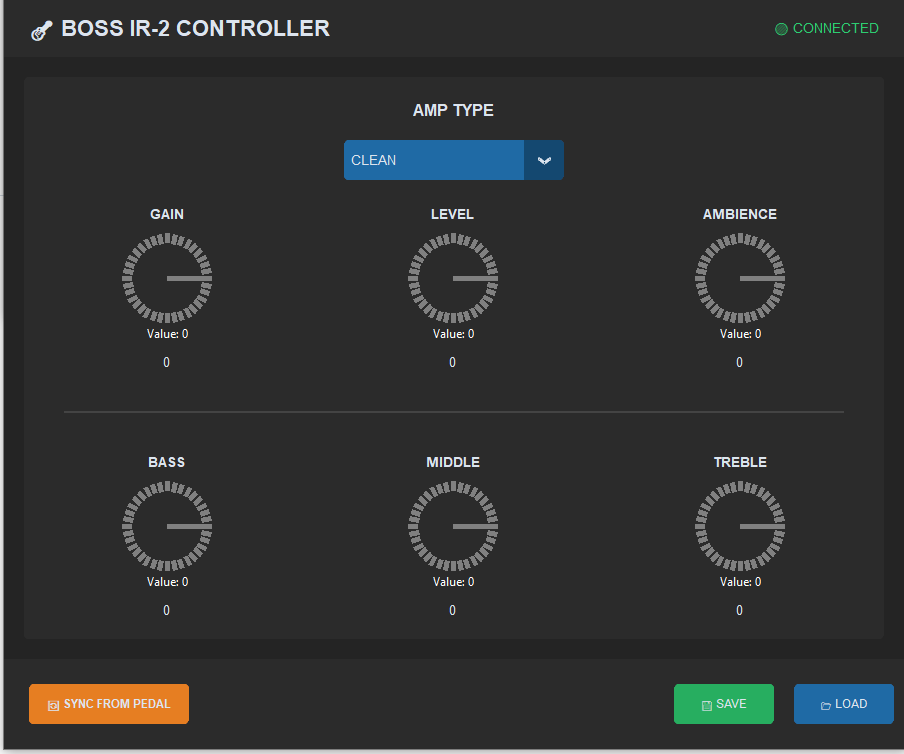

# BOSS IR-2 Controller 🎸

An unofficial, open-source Python controller and preset manager for the **BOSS IR-2 Amp & Cabinet** pedal.



## Features

- 🎛️ **Full Real-time Control**: Adjust Gain, Level, Ambience, and 3-Band EQ.
- 🔊 **Amp Model Selection**: Switch between all 11 amp models instantly.
- 💾 **Preset Manager**: Save and Load your favorite tones to JSON files.
- 🔄 **Bidirectional Sync**: Read the current state from the pedal to the GUI.
- 🖥️ **Modern GUI**: Dark mode interface with rotary knobs (using `customtkinter` & `tkdial`).

## Installation

## Quick Start

### 🚀 Pre-compiled Executable (Easiest)

**Download the standalone EXE from [Releases](https://github.com/Gdadamo/boss_ir2_controller/releases)** - No Python installation needed!

1. Download `BOSS_IR2_Controller.exe` from the latest release
2. Connect your BOSS IR-2 via USB
3. Run it directly
4. Start controlling!

## From Source

1. **Install Python 3.10+**
2. **Install dependencies**:
   ```bash
   pip install -r requirements.txt
   ```

## Usage

1. Connect your BOSS IR-2 via USB.
2. Run the GUI:
   ```bash
   python run.py
   ```
3. Click **SYNC FROM PEDAL** to read current settings.
4. Enjoy tweaking!

## Project Structure

- `src/`: Main application code (GUI and Control Logic).
- `docs/`: Documentation and screenshots.

## Requirements

- `mido`
- `python-rtmidi`
- `customtkinter`
- `tkdial`

## Legal Disclaimer

### Not Affiliated or Endorsed

This project is **completely unofficial** and is in no way affiliated with, endorsed by, sponsored by, or associated with **Roland Corporation**, **BOSS**, or any of their subsidiaries or affiliated entities.

**BOSS IR-2** is a registered trademark of Roland Corporation. All intellectual property rights, including but not limited to trademarks, patents, copyrights, and trade secrets related to the BOSS IR-2 hardware and firmware, are the exclusive property of Roland Corporation.

### Disclaimer of Liability

This software is provided on an **"AS-IS" basis without any warranties, express or implied**. The developers and contributors make no representations or warranties regarding:

- The accuracy, reliability, or completeness of this software
- Its fitness for any particular purpose
- Its non-infringement of third-party intellectual property rights

**USE AT YOUR OWN RISK.** The developers assume no responsibility for any damage, loss of data, or adverse effects that may result from:

- Using this software
- Modifications made to your BOSS IR-2 device through this software
- Incompatibility issues
- Device malfunction or permanent damage

### License

This software is released under the **MIT License** (see LICENSE file). However, the MIT License applies only to the original source code created by contributors. It does not grant any rights to Roland Corporation's intellectual property.

### Limitation of Use

Users acknowledge and agree that they use this software entirely at their own discretion and risk. Under no circumstances shall the developers, contributors, or maintainers of this project be liable for any indirect, incidental, special, consequential, or punitive damages, including but not limited to loss of profits or data.
